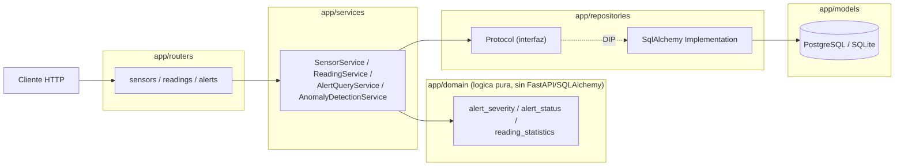

# sdlc-electronica-Cesar-David-Salas-Martinez

## Repositorio creado para el curso EDSIA  

### Carpetas con nombre de semana y archivos de las actividades  

### Archivo de checklist en cada una  

## Presentacion:  
Mi nombre es Cesar David, estudio ingeneria en instrumentacion electronica, voy en 7 semestre, tengo un gusto mas acerca de la electronica enfocada en audio,
la programacion siempre me ha interesado pero siempre he sentido algo disperso mi conocimiento de esta, me llama la atencion el lenguaje ensamblador por su 
cercania al hardware, en este curso espero aprender mas sobre estas conexiones mas cercanas entre la electronuca y la programacion, a su vez de buenas practicas 
de trabajo en programacion.  

## Badge:  


## Instalación:  
Para poder instalar el repositorio desde la terminal se puede usar el comando:  

git clone https://github.com/Choclititito/sdlc-electronica-Cesar-David-Salas-Martinez  

Herramientas:  
-Visual Studio Code  
-Python  
-Git  
-WSL2  
-Pytest  
-Ruff  

## Como correr los tests:  
Para poder correrlos hay que usar el comando:  
python -m pytest "ubicacion del archivo" -v  
Esta ubicacion dependiendo de donde tengas la consola ubicada, esto pudiendolo cambiar con el comando:  
cd "ubicacion deseada"  

Igualmente con el ruff check "ubicacion del archivo"  

## Reflexión SOLID:  
Los principios SOLID, aunque me costo entenderlos al principio, despues pude hacerlo, gracias a entender los fundamentos de la programacion enfocada en objetos, ya con esa informacion los pude entender mejor, me parecen principios que ayudan bastante a tener codigos que se pueda trabajar en equipo, y escalables sin tener tantos problemas, en comparacion con otras formas de programar.  


Aqui una imagen que me gusto:  

  


## API desplegada  

URL pública: https://sensorhub-api-bret.onrender.com
Documentación interactiva: https://sensorhub-api-bret.onrender.com/docs  

Nota: el plan gratuito de Render "duerme" tras 15 minutos de inactividad.  
La primera petición después de eso puede tardar hasta un minuto en responder.  

## Despliegue continuo  

Cada push a `main` dispara automáticamente un nuevo build y despliegue en Render.  

  

  

El commit que actualizó la versión de la API a 1.0.1 disparó este redeploy automático sin intervención manual, visible en el dashboard de Render.  

## Arquitectura

### Capas del sistema



### Flujo: creación de lectura y detección de anomalías

```mermaid
sequenceDiagram
    participant C as Cliente
    participant R as reading_router
    participant RS as ReadingService
    participant AD as AnomalyDetectionService
    participant Dom as alert_severity (dominio puro)
    participant AR as AlertRepository
    participant N as AlertNotifier (OCP)
    participant DB as PostgreSQL

    C->>R: POST /sensors/{id}/readings
    R->>RS: record_for_sensor(value, unit)
    RS->>RS: validate_physics()
    RS->>DB: guarda la lectura
    R->>AD: evaluate(sensor_id, reading_id, value)
    AD->>Dom: determine_severity(value, min, max)
    Dom-->>AD: WARNING / CRITICAL / None
    alt severidad detectada
        AD->>AR: add(alerta con severity y status=open)
        AR->>DB: guarda la alerta
        AD->>N: notify(alerta)
        N-->>AD: log estructurado JSON
    end
    AD-->>R: (sin retorno bloqueante)
    R-->>C: 201 Created (la lectura)

